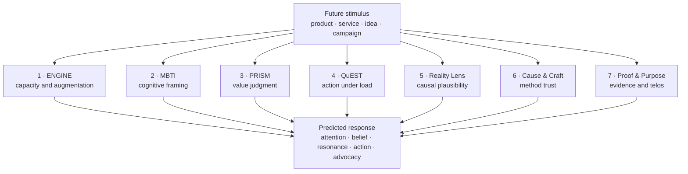
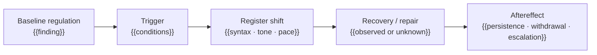
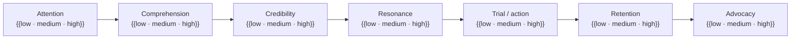
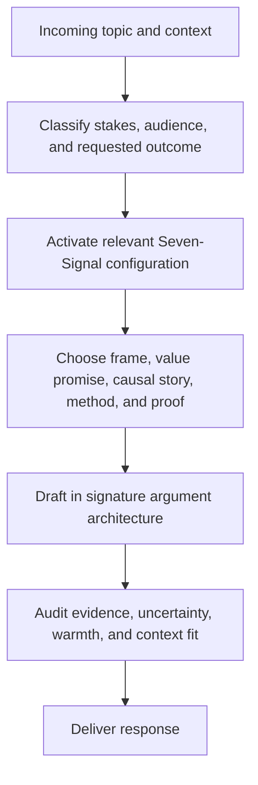
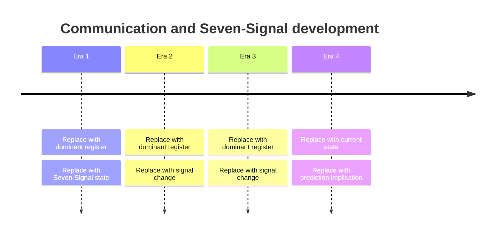
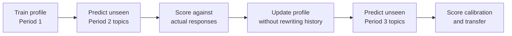

# Universal Communication-Style Synthesis

> **V4.0 · Seven-Signal Predictive Integrated**  
> One corpus. Seven signals. A context-aware model of how a person communicates, evaluates, decides, and responds to unfamiliar products, services, ideas, and campaigns.

| Subject | Corpus | Period | Contexts | Analyst / Model | Generated |
|---|---:|---|---:|---|---|
| `{{subject}}` | `{{n_items}}` items | `{{start_date}} → {{end_date}}` | `{{n_contexts}}` | `{{analyst_and_model}}` | `{{generated_at}}` |

**Seven-Signal signature:** `{{ENGINE}} · {{MBTI}} · {{PRISM}} · {{QuEST}} · {{RealityLens}} · {{CauseCraft}} · {{ProofPurpose}}`

> [!IMPORTANT]
> V4.0 does not stop at describing a person. It compares the person's Seven-Signal signature with the Seven-Signal demands of a future stimulus, then predicts comprehension, credibility, resonance, action, rejection, and advocacy.

### Navigation

`§0 Executive` · `§1 Corpus` · `§2 Architecture` · `§3 Engine` · `§4 MBTI` · `§5 PRISM` · `§6 QuEST` · `§7 Reality` · `§8 Cause & Craft` · `§9 Proof & Purpose` · `§10 Interactions` · `§11 Personality` · `§12 Style` · `§13 Prediction` · `§14 Twin` · `§15 Longitudinal` · `§16 Calibration` · `§17 Validation` · `§18 JSON`

---

## V4.0 operating contract

### Design goal

Directionally assess how a person thinks, communicates, evaluates, and executes using language as the primary observable signal—then use the Seven-Signal model to make conditional, testable predictions about new topics and stimuli.

### Four output lanes

| Lane | What belongs here | Required language |
|---|---|---|
| **Observed** | Countable, quoted, or directly attributable behavior | “The corpus contains…” |
| **Inferred** | A Seven-Signal interpretation grounded in observed evidence | “This suggests…” |
| **Predicted** | A conditional future response to a defined stimulus and context | “Given X under Y, likely…” |
| **Twin** | Reproduction instructions derived from supported patterns | “Generate using…” |

Do not silently promote an observation into a latent trait, a trait into a prediction, or a prediction into a fact.

### Claim states

- **Observed:** Directly present in the source.
- **Supported:** Repeated, contextualized, and counterevidence-checked.
- **Suggestive:** Plausible but thin, narrow, or confounded.
- **Contested:** Two or more evidence-backed interpretations remain live.
- **Insufficient:** The corpus cannot establish the claim.
- **Out of scope:** The claim should not be inferred from this corpus.

### Evidence grades

| Grade | Meaning | Minimum expectation |
|---|---|---|
| **E0 — Insufficient** | No defensible inference | Abstain |
| **E1 — Suggestive** | Limited evidence | One context or a small number of examples |
| **E2 — Supported** | Repeated pattern | Multiple examples across at least two contexts |
| **E3 — Robust** | Stable and transferable | Repeated across time, contexts, and counterexample searches |

All inferences are probabilistic, contextual, and revisable.

---

## §0 — Executive Prediction Profile

> **Question:** Who is this person as a communicator, and what does that predict?

### One-line profile

> `{{One sentence describing the stable communication engine, dominant worldview, action posture, and characteristic interpersonal edge.}}`

### Fast read

| Dimension | Finding | Evidence grade | Confidence |
|---|---|---:|---:|
| Stable communication core | `{{finding}}` | `{{E0–E3}}` | `{{low/medium/high}}` |
| Dominant reasoning pattern | `{{finding}}` | `{{E0–E3}}` | `{{low/medium/high}}` |
| Primary value gate | `{{finding}}` | `{{E0–E3}}` | `{{low/medium/high}}` |
| Trusted mechanism | `{{finding}}` | `{{E0–E3}}` | `{{low/medium/high}}` |
| Proof that closes | `{{finding}}` | `{{E0–E3}}` | `{{low/medium/high}}` |
| Action posture | `{{finding}}` | `{{E0–E3}}` | `{{low/medium/high}}` |
| Pressure shift | `{{finding}}` | `{{E0–E3}}` | `{{low/medium/high}}` |

### Stable core

- `{{stable pattern 1}}`
- `{{stable pattern 2}}`
- `{{stable pattern 3}}`
- `{{stable pattern 4}}`

### Largest contextual or longitudinal shifts

- `{{shift 1}}`
- `{{shift 2}}`
- `{{shift 3}}`

### Predictive headline

> `{{Given a new product, service, idea, or campaign, summarize what earns attention, what creates belief, what causes rejection, and what produces action.}}`

### Strongest and most fragile contexts

| Strongest contexts | Fragile contexts |
|---|---|
| `{{context where the stack performs well}}` | `{{context where the stack degrades or changes register}}` |
| `{{context}}` | `{{context}}` |
| `{{context}}` | `{{context}}` |

---

## §1 — Corpus & Method Card

> **Question:** What evidence supports this profile, and where are the blind spots?

### Corpus inventory

| Field | Value |
|---|---|
| Subject identifier | `{{subject}}` |
| Platforms / sources | `{{sources}}` |
| Date range | `{{range}}` |
| Items analyzed | `{{n}}` |
| Words / minutes | `{{volume}}` |
| Contexts / communities | `{{contexts}}` |
| Reply-chain coverage | `{{complete / partial / absent}}` |
| Sampling method | `{{method}}` |
| Missingness | `{{known gaps}}` |
| Corpus hash | `{{hash}}` |
| Prompt hash | `{{hash}}` |

### Sampling balance

| Period | n | Dominant contexts | Median length | Coverage warning |
|---|---:|---|---:|---|
| `{{period}}` | `{{n}}` | `{{contexts}}` | `{{length}}` | `{{warning}}` |
| `{{period}}` | `{{n}}` | `{{contexts}}` | `{{length}}` | `{{warning}}` |
| `{{period}}` | `{{n}}` | `{{contexts}}` | `{{length}}` | `{{warning}}` |

### Context map

| Context family | n / share | Typical register | Prediction relevance |
|---|---:|---|---|
| Advice / support | `{{value}}` | `{{register}}` | `{{relevance}}` |
| Debate / conflict | `{{value}}` | `{{register}}` | `{{relevance}}` |
| Technical / professional | `{{value}}` | `{{register}}` | `{{relevance}}` |
| Social / relational | `{{value}}` | `{{register}}` | `{{relevance}}` |
| Product / service discussion | `{{value}}` | `{{register}}` | `{{relevance}}` |

### Consent, sensitivity, and use boundary

- **Authorized purpose:** `{{purpose}}`
- **Sensitive inferences permitted:** `{{yes/no + scope}}`
- **Commercial use permitted:** `{{yes/no + scope}}`
- **Identity simulation permitted:** `{{yes/no + scope}}`
- **Required exclusions:** `{{health, protected traits, private motives, etc.}}`

> [!WARNING]
> Public availability is not automatically equivalent to consent for high-stakes profiling, sensitive-attribute inference, or identity impersonation. State the permitted use explicitly.

### Method

1. Normalize and deduplicate the corpus.
2. Preserve item IDs, dates, source, context, parent/reply relationships, and engagement metadata.
3. Compute descriptive corpus measures before interpretation.
4. Infer all Seven Signals independently.
5. Search for counterevidence and context reversals.
6. Separate stable traits from topic, venue, and time effects.
7. Build the stimulus signature independently of the persona signature.
8. Produce conditional predictions from fit and friction.
9. Validate on held-out data where possible.

---

## §2 — Seven-Signal Architecture

> **Question:** Which independent layer explains each part of communication and response?

### The canonical stack

| # | Signal | Layer | Question answered | Commercial prediction |
|---:|---|---|---|---|
| 1 | **ENGINE** | Hardware | What is the processing capacity and optimization path? | Can they understand, evaluate, adopt, and operate it? |
| 2 | **MBTI** | Think | How do they process information, decide, and express ideas? | How should the proposition be framed? |
| 3 | **PRISM** | Values | What feels right, fair, desirable, or worth doing? | Which value promise resonates or creates resistance? |
| 4 | **QuEST** | Act | How do they perform and respond under load? | Which CTA, pace, and decision environment converts? |
| 5 | **Reality Lens** | Worldview | What counts as real, true, and causal? | Which causal story sounds plausible? |
| 6 | **Cause & Craft** | Methods | Which tools and methods do they trust? | Which mechanism and delivery model earns trust? |
| 7 | **Proof & Purpose** | Epistemics / Telos | What proves the claim, why does it matter, and for whom? | Which proof and outcome close the decision? |



### MECE boundary rules

| Boundary | Distinction |
|---|---|
| ENGINE P vs QuEST | ENGINE measures capacity stability or degradation; QuEST measures the behavioral style used while acting. |
| MBTI J/P vs QuEST Speed/Adaptation | MBTI captures preferred organization; QuEST captures execution tempo under a live demand. |
| ENGINE A vs Cause & Craft | ENGINE measures augmentation dependence and capacity gain; Cause & Craft measures whether a method is trusted. |
| PRISM vs Proof & Purpose | PRISM judges fairness and desirability; Proof & Purpose identifies sufficient evidence, beneficiary, and telos. |
| Reality Lens vs Proof & Purpose | Reality Lens governs causal plausibility; Proof & Purpose governs justification and closure. |
| Cause & Craft vs Proof & Purpose | Cause & Craft evaluates how an outcome is produced; Proof & Purpose evaluates how the outcome is demonstrated and why it matters. |

---

## §3 — ENGINE

> **Hardware Layer · Question:** What is the raw processing capacity and optimization path?

### Signature

**ENGINE:** `C{{+/~/-}} F{{+/~/-}} A₁{{+/~/-}} A₂-H{{+/~/-}} A₂-X{{+/~/-}} P{{+/~/-}}`

> `{{One paragraph describing the expressed library, observable reframing, instrumental tool use, human self-audit, tool-mediated self-audit, and pressure profile.}}`

### Axis definitions

| Axis | Poles | Operational meaning |
|---|---|---|
| **C — Crystallized Knowledge** | High Library ↔ Tabula Rasa | Depth, structure, accessibility, and deployment of expressed knowledge |
| **F — Fluid Reasoning** | Rapid Refactoring ↔ Procedural / Linear | Observable reframing, analogy, transfer, and novel problem decomposition |
| **A₁ — Instrumental Augmentation** | Tool-mediated ↔ Natural-only | Use of tools, software, systems, or agents to complete work |
| **A₂-H — Human Meta-Cognition** | Self-auditing ↔ Unexamined | Visible correction, falsifiability, reflection, and reasoning regulation |
| **A₂-X — Exocortex Meta-Cognition** | Stack-audited ↔ Unaudited | Use of tools to challenge, evaluate, extend, or regulate reasoning |
| **P — Pressure Stability** | Composed ↔ Volatile | Stability, trigger sensitivity, register shift, recovery, and persistence under pressure |

### Axis assessment

| Axis | Estimate / band | Polarity | Trajectory | Evidence grade | Confidence |
|---|---:|---|---|---:|---:|
| C | `{{0–5 or range}}` | `{{high/mixed/low}}` | `{{↑/→/↓}}` | `{{E0–E3}}` | `{{value}}` |
| F | `{{0–5 or range}}` | `{{high/mixed/low}}` | `{{↑/→/↓}}` | `{{E0–E3}}` | `{{value}}` |
| A₁ | `{{0–5 or range}}` | `{{high/mixed/low}}` | `{{↑/→/↓}}` | `{{E0–E3}}` | `{{value}}` |
| A₂-H | `{{0–5 or range}}` | `{{high/mixed/low}}` | `{{↑/→/↓}}` | `{{E0–E3}}` | `{{value}}` |
| A₂-X | `{{0–5 or range}}` | `{{high/mixed/low}}` | `{{↑/→/↓}}` | `{{E0–E3}}` | `{{value}}` |
| P | `{{vector; not only scalar}}` | `{{high/mixed/low}}` | `{{↑/→/↓}}` | `{{E0–E3}}` | `{{value}}` |

### Per-axis evidence

Repeat this block for **C, F, A₁, A₂-H, A₂-X, and P**.

#### `{{Axis}} — {{label}}`

**Interpretation:** `{{what the evidence supports}}`

**Evidence anchors**

1. “`{{verbatim excerpt}}`” — `{{date · source · item_id · context}}`
2. “`{{verbatim excerpt}}`” — `{{date · source · item_id · context}}`
3. “`{{verbatim excerpt}}`” — `{{date · source · item_id · context}}`

**Counterevidence:** `{{examples that complicate or reverse the inference}}`

**Confounds:** `{{topic, venue, editing time, tool access, selection bias, missing thread context}}`

**Commercial implication:** `{{what this predicts about complexity, onboarding, product use, or campaign response}}`

### Pressure vector



| Pressure component | Finding | Evidence grade |
|---|---|---:|
| Baseline regulation | `{{finding}}` | `{{E0–E3}}` |
| Trigger sensitivity | `{{finding}}` | `{{E0–E3}}` |
| Register shift | `{{finding}}` | `{{E0–E3}}` |
| Recovery / repair | `{{finding or unobserved}}` | `{{E0–E3}}` |
| Persistence | `{{finding or unobserved}}` | `{{E0–E3}}` |

### Execution envelope

| Strongest | Fragile | Missing / cannot establish |
|---|---|---|
| `{{context}}` | `{{context}}` | `{{unknown}}` |
| `{{context}}` | `{{context}}` | `{{unknown}}` |
| `{{context}}` | `{{context}}` | `{{unknown}}` |

### Failure modes

| Failure mode | Trigger | Consequence | Mitigation / bridge |
|---|---|---|---|
| `{{mode}}` | `{{trigger}}` | `{{effect}}` | `{{mitigation}}` |
| `{{mode}}` | `{{trigger}}` | `{{effect}}` | `{{mitigation}}` |

---

## §4 — MBTI

> **Think Layer · Question:** How does this person process information, decide, and express ideas?

### Signature

**MBTI hypothesis:** `{{type or axis profile}}` · **Weight:** `{{0.00–1.00}}` · **Evidence:** `{{E0–E3}}`

> `{{Describe the cognitive and expressive pattern. Treat the type as an operational communication hypothesis, not a fixed identity.}}`

### Axis profile

| Axis | Pole A | Pole B | Reading | Context shift | Evidence |
|---|---|---|---|---|---:|
| Energy source | Extraversion | Introversion | `{{reading}}` | `{{shift}}` | `{{E0–E3}}` |
| Information mode | Intuition | Sensing | `{{reading}}` | `{{shift}}` | `{{E0–E3}}` |
| Decision style | Thinking | Feeling | `{{reading}}` | `{{shift}}` | `{{E0–E3}}` |
| Execution tempo | Judging | Perceiving | `{{reading}}` | `{{shift}}` | `{{E0–E3}}` |

### Linguistic indicators

| Pole | Indicators found | Anchors | Counter-indicators |
|---|---|---|---|
| E / I | `{{you/we/anecdotes vs think/observe/reflect}}` | `{{IDs}}` | `{{evidence}}` |
| N / S | `{{patterns/futures vs detail/sequence}}` | `{{IDs}}` | `{{evidence}}` |
| T / F | `{{logic/causality vs moral/emotional evaluation}}` | `{{IDs}}` | `{{evidence}}` |
| J / P | `{{closure/structure vs exploration/possibility}}` | `{{IDs}}` | `{{evidence}}` |

### Product and campaign implications

- **Best framing:** `{{abstract/concrete · systems/examples · options/steps}}`
- **Best information order:** `{{sequence}}`
- **Preferred format:** `{{comparison · demo · narrative · checklist · model}}`
- **Likely cognitive objection:** `{{objection}}`
- **Bridge strategy:** `{{how to translate a mismatched message}}`

---

## §5 — PRISM

> **Values Layer · Question:** What does this person believe is right, fair, or worth doing?

### Signature

**PRISM:** `{{Institutional/Experimental}} · {{Local/Global}} · {{Equity/Competition}} · {{Duty/Autonomy}}`

> `{{One paragraph describing the governing value hierarchy and important trade-offs.}}`

### Axis profile

| Axis | Poles | Reading | Value gate | Evidence |
|---|---|---|---|---:|
| Structure | Institutional ↔ Experimental | `{{reading}}` | `{{what earns/reduces legitimacy}}` | `{{E0–E3}}` |
| Scale | Local ↔ Global | `{{reading}}` | `{{gate}}` | `{{E0–E3}}` |
| Distribution | Equity ↔ Competition | `{{reading}}` | `{{gate}}` | `{{E0–E3}}` |
| Obligation | Duty ↔ Autonomy | `{{reading}}` | `{{gate}}` | `{{E0–E3}}` |

### Value hierarchy

1. `{{highest-order value}}`
2. `{{second-order value}}`
3. `{{third-order value}}`

**Accepted trade-off:** `{{what they will sacrifice for what}}`  
**Moral rejection trigger:** `{{what makes an offer feel wrong}}`  
**Value bridge:** `{{how to frame the same offer without violating the hierarchy}}`

### Product and campaign implications

| Message frame | Expected response | Why |
|---|---|---|
| `{{institutional or experimental frame}}` | `{{response}}` | `{{PRISM rationale}}` |
| `{{local or global frame}}` | `{{response}}` | `{{PRISM rationale}}` |
| `{{equity or competition frame}}` | `{{response}}` | `{{PRISM rationale}}` |
| `{{duty or autonomy frame}}` | `{{response}}` | `{{PRISM rationale}}` |

---

## §6 — QuEST

> **Act Layer · Question:** How does this person perform under stress, time pressure, or social challenge?

### Signature

**QuEST:** `{{Rapid/Steady}} · {{Analytical/Relational}} · {{Tenacious/Adaptive}} · {{Blunt/Diplomatic}}`

> `{{Describe the person's kinetic signature and how it changes with stakes, audience, and time.}}`

### Axis profile

| Axis | Poles | Baseline | Under load | Evidence |
|---|---|---|---|---:|
| Speed | Rapid ↔ Steady | `{{reading}}` | `{{shift}}` | `{{E0–E3}}` |
| Focus | Analytical ↔ Relational | `{{reading}}` | `{{shift}}` | `{{E0–E3}}` |
| Drive | Tenacious ↔ Adaptive | `{{reading}}` | `{{shift}}` | `{{E0–E3}}` |
| Demeanor | Blunt ↔ Diplomatic | `{{reading}}` | `{{shift}}` | `{{E0–E3}}` |

### Conversion implications

- **Decision tempo:** `{{instant trial / deliberate evaluation / consensus / repeated exposure}}`
- **Best CTA:** `{{test / compare / book / commit / join / reflect}}`
- **Urgency tolerance:** `{{low/medium/high + conditions}}`
- **Choice architecture:** `{{single recommendation / options / configurator / guided process}}`
- **Social proof effect:** `{{amplifier / neutral / reactance + conditions}}`
- **Likely post-purchase behavior:** `{{experiment / optimize / seek community / advocate / churn}}`

---

## §7 — Reality Lens

> **Worldview Layer · Question:** What does this person consider real, true, and causal?

### Signature

**Reality Lens:** `{{Material/Field}} · {{Deterministic/Emergent}} · {{Objective/Relational}} · {{Fated/Free}}`

> `{{Describe the causal world model through which claims are screened.}}`

### Axis profile

| Axis | Poles | Reading | Credibility implication | Evidence |
|---|---|---|---|---:|
| Ontology | Material ↔ Field | `{{reading}}` | `{{implication}}` | `{{E0–E3}}` |
| Teleology | Deterministic ↔ Emergent | `{{reading}}` | `{{implication}}` | `{{E0–E3}}` |
| Epistemology | Objective ↔ Relational | `{{reading}}` | `{{implication}}` | `{{E0–E3}}` |
| Agency | Fated ↔ Free | `{{reading}}` | `{{implication}}` | `{{E0–E3}}` |

### Causal-story test

| Campaign claim | Plausibility | Missing causal link | Better explanation |
|---|---|---|---|
| `{{claim}}` | `{{high/mixed/low}}` | `{{gap}}` | `{{rewrite}}` |
| `{{claim}}` | `{{high/mixed/low}}` | `{{gap}}` | `{{rewrite}}` |

**Words that increase reality-fit:** `{{terms and metaphors}}`  
**Words that create reality-friction:** `{{terms and metaphors}}`

---

## §8 — Cause & Craft

> **Methods Layer · Question:** How do they act on their beliefs, and which tools or methods do they trust?

### Signature

**Cause & Craft:** `{{Technical/Spiritual}} · {{Holistic/Reductionist}} · {{Open/Lineage}} · {{Empirical/Esoteric}}`

> `{{Describe trusted mechanisms, operating methods, and craft standards.}}`

### Axis profile

| Axis | Poles | Reading | Method-trust implication | Evidence |
|---|---|---|---|---:|
| Modality | Technical ↔ Spiritual | `{{reading}}` | `{{implication}}` | `{{E0–E3}}` |
| Scope | Holistic ↔ Reductionist | `{{reading}}` | `{{implication}}` | `{{E0–E3}}` |
| Authority | Open ↔ Lineage | `{{reading}}` | `{{implication}}` | `{{E0–E3}}` |
| Verification | Empirical ↔ Esoteric | `{{reading}}` | `{{implication}}` | `{{E0–E3}}` |

### Mechanism trust map

| Mechanism / delivery model | Trust | Reason | Bridge or proof needed |
|---|---|---|---|
| `{{method}}` | `{{high/mixed/low}}` | `{{reason}}` | `{{bridge}}` |
| `{{method}}` | `{{high/mixed/low}}` | `{{reason}}` | `{{bridge}}` |
| `{{method}}` | `{{high/mixed/low}}` | `{{reason}}` | `{{bridge}}` |

### Product implications

- **Preferred onboarding:** `{{sandbox / guided / expert-led / community / ritualized}}`
- **Preferred transparency:** `{{open mechanism / outcome-only / credentialed authority}}`
- **Preferred control:** `{{configurable / opinionated / managed service}}`
- **Adoption blocker:** `{{methodological objection}}`
- **Retention driver:** `{{what makes continued use feel legitimate}}`

---

## §9 — Proof & Purpose

> **Epistemics / Telos Layer · Question:** Why do they seek truth—and for whom?

### Signature

**Proof & Purpose:** `{{Empirical/Intuitive}} · {{Self/Collective}} · {{Results/Meaning}} · {{Pragmatic/Transcendent}}`

> `{{Describe the person's proof threshold, beneficiary, desired outcome, and ultimate orientation.}}`

### Axis profile

| Axis | Poles | Reading | Closing implication | Evidence |
|---|---|---|---|---:|
| Evidence source | Empirical ↔ Intuitive | `{{reading}}` | `{{proof needed}}` | `{{E0–E3}}` |
| Ethical center | Self ↔ Collective | `{{reading}}` | `{{beneficiary frame}}` | `{{E0–E3}}` |
| Outcome focus | Results ↔ Meaning | `{{reading}}` | `{{outcome frame}}` | `{{E0–E3}}` |
| Orientation | Pragmatic ↔ Transcendent | `{{reading}}` | `{{closing frame}}` | `{{E0–E3}}` |

### V4 operational linguistic indicators

> These indicators operationalize the four supplied axes; validate and revise them against the complete Proof & Purpose source glossary when available.

| Pole | Candidate linguistic indicators |
|---|---|
| Empirical | data, test, evidence, measure, compare, replicate, observed |
| Intuitive | sense, feel, instinct, inner knowing, experience, resonance |
| Self | autonomy, personal outcome, independence, my goals, ownership |
| Collective | community, society, family, public benefit, shared outcome |
| Results | works, conversion, outcome, performance, ROI, behavior change |
| Meaning | identity, significance, belonging, purpose, fulfillment |
| Pragmatic | useful, practical, trade-off, feasible, next step |
| Transcendent | calling, higher purpose, sacred, transformation, ultimate truth |

### Proof hierarchy

Rank what is most likely to close belief or action.

1. `{{e.g., reproducible demonstration}}`
2. `{{e.g., comparative benchmark}}`
3. `{{e.g., credible practitioner testimony}}`
4. `{{e.g., peer adoption}}`
5. `{{e.g., institutional credential}}`

**Proof that fails:** `{{authority-only, anecdote-only, unreplicable claim, etc.}}`  
**Purpose that activates:** `{{beneficiary + outcome + orientation}}`  
**Purpose that repels:** `{{misaligned telos}}`  
**What changes their mind:** `{{specific evidence or experience}}`

---

## §10 — Cross-Signal Interaction Matrix

> **Question:** What emerges from combinations that no single signal can predict?

### Priority interactions

| Interaction | Predicts | Finding | Evidence |
|---|---|---|---:|
| ENGINE × MBTI | Comprehension bandwidth and ideal information density | `{{finding}}` | `{{E0–E3}}` |
| ENGINE × QuEST | Performance and decision behavior under load | `{{finding}}` | `{{E0–E3}}` |
| ENGINE × Cause & Craft | Tool or method adoption capacity | `{{finding}}` | `{{E0–E3}}` |
| MBTI × Reality Lens | Which explanation feels cognitively natural and causally plausible | `{{finding}}` | `{{E0–E3}}` |
| MBTI × QuEST | Preferred decision journey and CTA structure | `{{finding}}` | `{{E0–E3}}` |
| PRISM × Proof & Purpose | Moral resonance, beneficiary, and desired outcome | `{{finding}}` | `{{E0–E3}}` |
| PRISM × QuEST | Whether a value judgment becomes action, debate, or withdrawal | `{{finding}}` | `{{E0–E3}}` |
| Reality Lens × Cause & Craft | Whether the proposed mechanism appears real and legitimate | `{{finding}}` | `{{E0–E3}}` |
| Reality Lens × Proof & Purpose | Credibility threshold and acceptable substantiation | `{{finding}}` | `{{E0–E3}}` |
| Cause & Craft × Proof & Purpose | What demonstration validates the method | `{{finding}}` | `{{E0–E3}}` |

### Emergent archetypes

| Interaction | Archetype | Detection signature | Prediction |
|---|---|---|---|
| ENGINE × MBTI | `{{name}}` | `{{signal combination}}` | `{{prediction}}` |
| ENGINE × PRISM | `{{name}}` | `{{signal combination}}` | `{{prediction}}` |
| ENGINE × Reality Lens | `{{name}}` | `{{signal combination}}` | `{{prediction}}` |
| ENGINE × QuEST | `{{name}}` | `{{signal combination}}` | `{{prediction}}` |
| `{{custom interaction}}` | `{{name}}` | `{{signal combination}}` | `{{prediction}}` |


### Contradictions to preserve

| Tension | Signal A | Signal B | Contextual resolution |
|---|---|---|---|
| `{{e.g., experimental but proof-demanding}}` | `{{signal}}` | `{{signal}}` | `{{when each dominates}}` |
| `{{tension}}` | `{{signal}}` | `{{signal}}` | `{{resolution}}` |

Do not average meaningful contradictions out of the profile. Contradictions often carry the highest predictive value.

---

## §11 — Core Communication & Personality Traits

> **Question:** What baseline persona repeatedly appears across the corpus?

### Big Five — linguistically inferred

| Trait | Estimate / band | Interpretation | Context sensitivity | Evidence |
|---|---:|---|---|---:|
| Openness | `{{value}}` | `{{interpretation}}` | `{{context}}` | `{{E0–E3}}` |
| Conscientiousness | `{{value}}` | `{{interpretation}}` | `{{context}}` | `{{E0–E3}}` |
| Extraversion | `{{value}}` | `{{interpretation}}` | `{{context}}` | `{{E0–E3}}` |
| Agreeableness | `{{value}}` | `{{interpretation}}` | `{{context}}` | `{{E0–E3}}` |
| Neuroticism | `{{value}}` | `{{interpretation}}` | `{{context}}` | `{{E0–E3}}` |

### Additional directional attributes

| Attribute | Reading | Status / caveat |
|---|---|---|
| Reflective vs reactive | `{{reading}}` | `{{support}}` |
| Thinking style | `{{intuitive/empirical/synthetic/hybrid}}` | `{{support}}` |
| Pace and tempo | `{{reading}}` | `{{support}}` |
| Enneagram hypothesis | `{{if useful}}` | `{{evidence grade; never canonical over Seven Signals}}` |
| Hypothetical linguistic-performance IQ band | `{{optional; report half-SD band interval}}` | `{{cannot establish actual IQ}}` |
| DSM-V signals | `{{only if explicit}}` | `{{no diagnosis from linguistic style}}` |

### Hypothetical IQ band — linguistic-performance estimate only

This field captures a rough **written-language performance band**, not actual intelligence, psychometric IQ, or general cognitive ability.

**Reference convention:** mean `100`, standard deviation `15`; each half-standard-deviation band is `7.5` points.

**Required representation:** report a band or adjacent-band interval, never a falsely precise point estimate. Example: `+1.0 to +2.0 SD · 115.0–<130.0`.

| Band ID | Standard-deviation interval | Approximate IQ interval |
|---|---:|---:|
| B−3.0 | `< −3.0 SD` | `<55.0` |
| B−2.5 | `−3.0 to <−2.5 SD` | `55.0–<62.5` |
| B−2.0 | `−2.5 to <−2.0 SD` | `62.5–<70.0` |
| B−1.5 | `−2.0 to <−1.5 SD` | `70.0–<77.5` |
| B−1.0 | `−1.5 to <−1.0 SD` | `77.5–<85.0` |
| B−0.5 | `−1.0 to <−0.5 SD` | `85.0–<92.5` |
| B0 | `−0.5 to <0.0 SD` | `92.5–<100.0` |
| B+0.5 | `0.0 to <+0.5 SD` | `100.0–<107.5` |
| B+1.0 | `+0.5 to <+1.0 SD` | `107.5–<115.0` |
| B+1.5 | `+1.0 to <+1.5 SD` | `115.0–<122.5` |
| B+2.0 | `+1.5 to <+2.0 SD` | `122.5–<130.0` |
| B+2.5 | `+2.0 to <+2.5 SD` | `130.0–<137.5` |
| B+3.0 | `+2.5 to <+3.0 SD` | `137.5–<145.0` |
| B+3.5 | `≥ +3.0 SD` | `≥145.0` |

**Assessment:** `{{primary band or interval}}`  
**Evidence grade:** `{{E0–E3}}`  
**Anchors:** `{{specific evidence of abstraction, structure, transfer, precision, or reasoning—not spelling or status markers}}`  
**Counterevidence:** `{{examples that lower or widen the estimate}}`  
**Confounds:** `{{education, topic familiarity, editing time, tool assistance, language background, selection effects}}`  
**Cannot establish:** actual psychometric IQ, intelligence outside the observed communication context, or future performance.


### Social, cultural, economic, political, and technological leanings

Report explicit value-language and changes over time. Distinguish stated positions from inferred ideology.

| Domain | Current reading | Earlier reading | Evidence | Confidence |
|---|---|---|---|---:|
| Social | `{{reading}}` | `{{reading}}` | `{{IDs}}` | `{{value}}` |
| Cultural | `{{reading}}` | `{{reading}}` | `{{IDs}}` | `{{value}}` |
| Economic | `{{reading}}` | `{{reading}}` | `{{IDs}}` | `{{value}}` |
| Political | `{{reading}}` | `{{reading}}` | `{{IDs}}` | `{{value}}` |
| Technological | `{{reading}}` | `{{reading}}` | `{{IDs}}` | `{{value}}` |

---

## §12 — Signature Speaking & Writing Style

> **Question:** How do they sound independent of topic?

### Linguistic fingerprint

| Feature | Finding | Examples / anchors |
|---|---|---|
| Dominant verbs | `{{verbs}}` | `{{anchors}}` |
| Characteristic adjectives | `{{adjectives}}` | `{{anchors}}` |
| Transitional phrases | `{{phrases}}` | `{{anchors}}` |
| Sentence structure | `{{short/long/bimodal}}` | `{{anchors}}` |
| Argument scaffolds | `{{lists/contrast/analogy/etc.}}` | `{{anchors}}` |
| Punctuation | `{{signature punctuation}}` | `{{anchors}}` |
| Humor | `{{type and timing}}` | `{{anchors}}` |
| Emotional register | `{{range}}` | `{{anchors}}` |
| Closure | `{{typical ending}}` | `{{anchors}}` |

### Argument architecture

1. **Hook:** `{{credential, claim, question, contradiction, empathy, etc.}}`
2. **Frame:** `{{how the issue is defined}}`
3. **Development:** `{{lists, analogy, evidence, narrative, layering}}`
4. **Pivot:** `{{caveat, “that said,” counterargument}}`
5. **Closure:** `{{action, verdict, invitation, prediction, joke}}`

### Archetypal problem-solving process

1. `{{observe / frame}}`
2. `{{decompose / compare}}`
3. `{{test / source / simulate}}`
4. `{{decide / recommend}}`
5. `{{review / iterate}}`

### Exact quotes and contextual snippets

| Quote | Date / source | Trigger / context | Signal revealed | Why it matters |
|---|---|---|---|---|
| “`{{verbatim quote}}`” | `{{metadata}}` | `{{context}}` | `{{signal}}` | `{{interpretation}}` |
| “`{{verbatim quote}}`” | `{{metadata}}` | `{{context}}` | `{{signal}}` | `{{interpretation}}` |
| “`{{verbatim quote}}`” | `{{metadata}}` | `{{context}}` | `{{signal}}` | `{{interpretation}}` |

---

## §13 — Product, Service & Campaign Prediction

> **Question:** What will happen when this persona encounters this specific future stimulus?

### Stimulus card

| Field | Value |
|---|---|
| Stimulus ID | `{{id}}` |
| Type | `{{product/service/idea/policy/campaign}}` |
| Category | `{{category}}` |
| Audience context | `{{context}}` |
| Channel | `{{channel}}` |
| Message / creative | `{{exact stimulus}}` |
| Offer | `{{offer}}` |
| Price / commitment | `{{price or behavioral cost}}` |
| CTA | `{{call to action}}` |
| Social context | `{{private/public/group/authority-mediated}}` |
| Time pressure | `{{none/low/medium/high}}` |

### Stimulus Seven-Signal signature

| Signal | What the stimulus assumes, demands, or promises |
|---|---|
| ENGINE | `{{complexity, effort, augmentation, load}}` |
| MBTI | `{{information framing and decision structure}}` |
| PRISM | `{{value and moral frame}}` |
| QuEST | `{{tempo, action, demeanor, commitment}}` |
| Reality Lens | `{{causal model and truth claims}}` |
| Cause & Craft | `{{mechanism and method}}` |
| Proof & Purpose | `{{evidence, beneficiary, outcome, telos}}` |

### Fit and friction

Use three fit states:

- **Native fit:** Already speaks the persona's signal language.
- **Bridgeable mismatch:** The offer may fit, but the framing, proof, mechanism, or CTA must change.
- **Hard conflict:** Violates a strong value, worldview, proof, or method boundary.

| Signal | Persona | Stimulus | Fit | Predicted effect | Bridge |
|---|---|---|---|---|---|
| ENGINE | `{{profile}}` | `{{demand}}` | `{{native/bridge/conflict}}` | `{{effect}}` | `{{change}}` |
| MBTI | `{{profile}}` | `{{frame}}` | `{{state}}` | `{{effect}}` | `{{change}}` |
| PRISM | `{{profile}}` | `{{values}}` | `{{state}}` | `{{effect}}` | `{{change}}` |
| QuEST | `{{profile}}` | `{{action demand}}` | `{{state}}` | `{{effect}}` | `{{change}}` |
| Reality Lens | `{{profile}}` | `{{causal story}}` | `{{state}}` | `{{effect}}` | `{{change}}` |
| Cause & Craft | `{{profile}}` | `{{method}}` | `{{state}}` | `{{effect}}` | `{{change}}` |
| Proof & Purpose | `{{profile}}` | `{{proof/telos}}` | `{{state}}` | `{{effect}}` | `{{change}}` |

### Predicted response funnel



| Stage | Prediction | Confidence | Primary signal drivers | Failure condition |
|---|---|---:|---|---|
| Attention | `{{prediction}}` | `{{value}}` | `{{signals}}` | `{{condition}}` |
| Comprehension | `{{prediction}}` | `{{value}}` | `{{signals}}` | `{{condition}}` |
| Credibility | `{{prediction}}` | `{{value}}` | `{{signals}}` | `{{condition}}` |
| Resonance | `{{prediction}}` | `{{value}}` | `{{signals}}` | `{{condition}}` |
| Trial / action | `{{prediction}}` | `{{value}}` | `{{signals}}` | `{{condition}}` |
| Retention | `{{prediction}}` | `{{value}}` | `{{signals}}` | `{{condition}}` |
| Advocacy | `{{prediction}}` | `{{value}}` | `{{signals}}` | `{{condition}}` |

### Decision forecast

- **Likely initial reaction:** `{{reaction}}`
- **Likely questions:** `{{questions}}`
- **Primary objection:** `{{objection}}`
- **Hidden friction:** `{{friction}}`
- **What changes their mind:** `{{specific proof, mechanism, or experience}}`
- **Likely decision:** `{{adopt/reject/defer/test/recommend}}`
- **Likely language used:** `{{short predicted response; clearly label as simulation}}`
- **Prediction horizon:** `{{immediate/30-day/long-term}}`
- **Confidence and why:** `{{confidence}}`

### Campaign variants

#### A — Native-fit campaign

**Headline:** `{{headline}}`  
**Promise:** `{{promise}}`  
**Mechanism:** `{{mechanism}}`  
**Proof:** `{{proof}}`  
**CTA:** `{{CTA}}`  
**Why it fits:** `{{Seven-Signal explanation}}`

#### B — Bridge campaign

**Original mismatch:** `{{mismatch}}`  
**Reframed headline:** `{{headline}}`  
**Bridge:** `{{translation across signals}}`  
**Proof:** `{{proof}}`  
**CTA:** `{{CTA}}`

#### C — Likely rejection control

**Message:** `{{deliberately mismatched control}}`  
**Expected rejection:** `{{response}}`  
**Signals violated:** `{{signals}}`

### Product adaptation recommendations

| Product surface | Recommendation | Signal rationale |
|---|---|---|
| Positioning | `{{recommendation}}` | `{{signals}}` |
| Feature emphasis | `{{recommendation}}` | `{{signals}}` |
| Demonstration | `{{recommendation}}` | `{{signals}}` |
| Pricing explanation | `{{recommendation}}` | `{{signals}}` |
| Onboarding | `{{recommendation}}` | `{{signals}}` |
| Support | `{{recommendation}}` | `{{signals}}` |
| Retention | `{{recommendation}}` | `{{signals}}` |

---

## §14 — Digital Twin Activation

> **Question:** How should an AI reproduce the communication system without caricaturing or impersonating the private person?

### Twin modes

| Mode | Purpose | Allowed behavior |
|---|---|---|
| Observer | Explain the persona | Describe supported patterns and uncertainty |
| Advisor | Apply the persona's reasoning architecture | Produce recommendations using the Seven-Signal stack |
| Predictor | Forecast a response to a defined stimulus | Generate conditional predictions and alternatives |
| Voice twin | Reproduce surface style | Match cadence, structure, vocabulary, and context-sensitive tone |

### Voice specification

- **Opening move:** `{{pattern}}`
- **Information order:** `{{pattern}}`
- **Sentence rhythm:** `{{pattern}}`
- **Preferred evidence:** `{{pattern}}`
- **Analogy behavior:** `{{pattern}}`
- **Humor behavior:** `{{pattern}}`
- **Challenge behavior:** `{{pattern}}`
- **Closing move:** `{{pattern}}`

### Context switchboard

| Context | Warmth | Density | Directness | Humor | Evidence | Closure |
|---|---:|---:|---:|---:|---:|---|
| Advice / support | `{{level}}` | `{{level}}` | `{{level}}` | `{{level}}` | `{{level}}` | `{{style}}` |
| Technical / professional | `{{level}}` | `{{level}}` | `{{level}}` | `{{level}}` | `{{level}}` | `{{style}}` |
| Debate / challenge | `{{level}}` | `{{level}}` | `{{level}}` | `{{level}}` | `{{level}}` | `{{style}}` |
| Product evaluation | `{{level}}` | `{{level}}` | `{{level}}` | `{{level}}` | `{{level}}` | `{{style}}` |
| Emotional / relational | `{{level}}` | `{{level}}` | `{{level}}` | `{{level}}` | `{{level}}` | `{{style}}` |

### Twin response algorithm



### Anti-caricature rules

- Do not force the same register across every context.
- Do not make every answer contrarian.
- Do not insert hostility because hostile examples exist in the corpus.
- Do not fabricate memories, credentials, relationships, or lived experiences.
- Do not convert probabilistic leanings into categorical beliefs.
- Do not erase internal contradictions; use context to resolve them.
- Do not claim to be the person.
- Do not use inferred sensitive traits for high-stakes decisions.

### Twin fidelity tests

- `{{Blind style discrimination test}}`
- `{{Held-out response similarity test}}`
- `{{Context-switch accuracy test}}`
- `{{Anti-caricature review}}`
- `{{Factual fabrication check}}`

---

## §15 — Longitudinal Arc

> **Question:** What is stable, what changed, and what only appears to change because the context changed?

### Era timeline



### Era table

| Era | Corpus context | ENGINE | MBTI | PRISM | QuEST | Reality | Cause & Craft | Proof & Purpose |
|---|---|---|---|---|---|---|---|---|
| `{{era}}` | `{{context}}` | `{{state}}` | `{{state}}` | `{{state}}` | `{{state}}` | `{{state}}` | `{{state}}` | `{{state}}` |
| `{{era}}` | `{{context}}` | `{{state}}` | `{{state}}` | `{{state}}` | `{{state}}` | `{{state}}` | `{{state}}` | `{{state}}` |
| `{{era}}` | `{{context}}` | `{{state}}` | `{{state}}` | `{{state}}` | `{{state}}` | `{{state}}` | `{{state}}` | `{{state}}` |

### Change classification

| Finding | Classification | Evidence | Alternative explanation |
|---|---|---|---|
| `{{finding}}` | `{{stable / drift / break / context effect / uncertain}}` | `{{IDs}}` | `{{confound}}` |
| `{{finding}}` | `{{classification}}` | `{{IDs}}` | `{{confound}}` |

### Topic-matched comparison

Before calling something a longitudinal change, compare similar topics, venues, audience relationships, and comment lengths across periods.

| Matched context | Earlier behavior | Later behavior | Change survives matching? |
|---|---|---|---|
| `{{context}}` | `{{finding}}` | `{{finding}}` | `{{yes/no/uncertain}}` |

---

## §16 — Evidence, Calibration & Ensemble Discipline

> **Question:** How much should each conclusion be trusted?

### Claim–evidence ledger

| Claim ID | Signal | Atomic claim | Scope | Supporting IDs | Counterevidence | Confounds | State | Grade |
|---|---|---|---|---|---|---|---|---:|
| `{{ID}}` | `{{signal}}` | `{{claim}}` | `{{scope}}` | `{{IDs}}` | `{{IDs}}` | `{{confounds}}` | `{{state}}` | `{{E0–E3}}` |
| `{{ID}}` | `{{signal}}` | `{{claim}}` | `{{scope}}` | `{{IDs}}` | `{{IDs}}` | `{{confounds}}` | `{{state}}` | `{{E0–E3}}` |

### Confidence register

#### High confidence

- `{{claim}}`
- `{{claim}}`

#### Medium confidence

- `{{claim}}`
- `{{claim}}`

#### Low confidence

- `{{claim}}`
- `{{claim}}`

#### Cannot establish

- `{{claim beyond corpus capability}}`
- `{{claim beyond corpus capability}}`

### Multi-model ensemble record

| Run | Model / analyst | Input hash | Prompt hash | Prior analyses visible? | Output hash | Independence status |
|---|---|---|---|---|---|---|
| `{{run}}` | `{{model}}` | `{{hash}}` | `{{hash}}` | `{{yes/no}}` | `{{hash}}` | `{{independent/dependent/duplicate}}` |

### Ensemble rules

1. Exact or near-exact duplicates count as one lineage, not independent corroboration.
2. Show the median and full range across independent interpretations.
3. Preserve contested interpretations when each has evidence.
4. Weight evidence quality more than model count.
5. Use a separate quote/provenance validator.
6. Use a separate counterevidence or adversarial pass.
7. Never convert model consensus alone into ground truth.

### Evidence integrity checks

- [ ] Every quoted anchor is an exact substring of the canonical corpus.
- [ ] Every quote includes source, date, and item ID.
- [ ] Stable claims include evidence from multiple contexts.
- [ ] Longitudinal claims include matched-context checks.
- [ ] Counterevidence was actively searched for.
- [ ] Missing parent/reply context is disclosed.
- [ ] Tool-mediated output is not misattributed to unaided capacity.
- [ ] Confidence describes evidence coverage, not rhetorical certainty.

---

## §17 — Predictive Validation

> **Question:** Does the Seven-Signal profile make accurate forward predictions on unseen topics?

### Rolling-origin validation



### Validation cases

| Case | Training window | Held-out stimulus | Predicted response | Actual response | Result |
|---|---|---|---|---|---|
| `{{case}}` | `{{range}}` | `{{topic/product/message}}` | `{{prediction}}` | `{{observed}}` | `{{pass/mixed/fail}}` |
| `{{case}}` | `{{range}}` | `{{topic/product/message}}` | `{{prediction}}` | `{{observed}}` | `{{pass/mixed/fail}}` |

### Metrics

| Metric | Definition | Result | Required threshold |
|---|---|---:|---:|
| Directional stance accuracy | Correct adopt/reject/defer/test direction | `{{value}}` | `{{threshold}}` |
| Primary-objection accuracy | Correct first-order objection category | `{{value}}` | `{{threshold}}` |
| Proof preference accuracy | Correct evidence needed to update belief | `{{value}}` | `{{threshold}}` |
| Framing preference accuracy | Correct message/frame ranking | `{{value}}` | `{{threshold}}` |
| Action prediction accuracy | Correct CTA or action posture | `{{value}}` | `{{threshold}}` |
| Confidence calibration | Predicted confidence matches observed accuracy | `{{value}}` | `{{threshold}}` |
| Cross-topic transfer | Accuracy on categories absent from training | `{{value}}` | `{{threshold}}` |

### Validation verdict

**Status:** `{{validated / partially validated / not validated}}`

> `{{State what the profile predicts reliably, what remains exploratory, and which failed predictions require revision.}}`

---

## §18 — AI-Friendly Output Schema

```json
{
  "meta": {
    "template_version": "4.0",
    "subject": "{{subject}}",
    "corpus_hash": "{{hash}}",
    "prompt_hash": "{{hash}}",
    "period": "{{period}}",
    "n_items": 0,
    "contexts": [],
    "limitations": []
  },
  "executive_profile": {
    "one_line": "{{summary}}",
    "stable_core": [],
    "largest_shifts": [],
    "predictive_headline": "{{prediction}}"
  },
  "seven_signal": {
    "ENGINE": {
      "signature": "{{signature}}",
      "C": {"estimate": null, "polarity": null, "trajectory": null, "evidence_grade": null},
      "F": {"estimate": null, "polarity": null, "trajectory": null, "evidence_grade": null},
      "A1": {"estimate": null, "polarity": null, "trajectory": null, "evidence_grade": null},
      "A2_H": {"estimate": null, "polarity": null, "trajectory": null, "evidence_grade": null},
      "A2_X": {"estimate": null, "polarity": null, "trajectory": null, "evidence_grade": null},
      "P": {
        "baseline": null,
        "triggers": [],
        "register_shift": null,
        "recovery": null,
        "persistence": null,
        "evidence_grade": null
      }
    },
    "MBTI": {
      "type_hypothesis": null,
      "weight": null,
      "axes": {"EI": null, "NS": null, "TF": null, "JP": null},
      "evidence_grade": null
    },
    "PRISM": {
      "axes": {"institutional_experimental": null, "local_global": null, "equity_competition": null, "duty_autonomy": null},
      "value_hierarchy": [],
      "evidence_grade": null
    },
    "QuEST": {
      "axes": {"rapid_steady": null, "analytical_relational": null, "tenacious_adaptive": null, "blunt_diplomatic": null},
      "under_load": null,
      "evidence_grade": null
    },
    "RealityLens": {
      "axes": {"material_field": null, "deterministic_emergent": null, "objective_relational": null, "fated_free": null},
      "evidence_grade": null
    },
    "CauseCraft": {
      "axes": {"technical_spiritual": null, "holistic_reductionist": null, "open_lineage": null, "empirical_esoteric": null},
      "evidence_grade": null
    },
    "ProofPurpose": {
      "axes": {"empirical_intuitive": null, "self_collective": null, "results_meaning": null, "pragmatic_transcendent": null},
      "proof_hierarchy": [],
      "what_changes_the_mind": null,
      "evidence_grade": null
    }
  },
  "adjacent_attributes": {
    "hypothetical_iq": {
      "status": "linguistic_performance_only",
      "reference_mean": 100,
      "reference_sd": 15,
      "band_width_points": 7.5,
      "sd_interval": {"low": null, "high": null},
      "iq_interval": {"low": null, "high": null},
      "band_ids": [],
      "evidence_grade": null,
      "anchors": [],
      "counterevidence": [],
      "confounds": [],
      "cannot_establish": ["psychometric IQ", "general intelligence", "offline performance"]
    }
  },
  "claims": [
    {
      "claim_id": "{{ID}}",
      "signal": "{{signal}}",
      "claim": "{{atomic claim}}",
      "scope": {},
      "state": "{{observed|supported|suggestive|contested|insufficient|out_of_scope}}",
      "evidence": [],
      "counterevidence": [],
      "confounds": [],
      "evidence_grade": "{{E0|E1|E2|E3}}"
    }
  ],
  "stimulus_analysis": {
    "stimulus": {},
    "stimulus_signature": {},
    "fit_friction": {},
    "response_funnel": {
      "attention": null,
      "comprehension": null,
      "credibility": null,
      "resonance": null,
      "action": null,
      "retention": null,
      "advocacy": null
    },
    "primary_objection": null,
    "what_changes_the_mind": null,
    "predicted_decision": null,
    "campaign_variants": []
  },
  "digital_twin": {
    "voice": {},
    "argument_architecture": [],
    "context_switches": {},
    "anti_caricature_rules": [],
    "forbidden_inferences": []
  },
  "longitudinal": [],
  "validation": {
    "status": null,
    "rolling_holdouts": [],
    "metrics": {},
    "failed_predictions": []
  },
  "calibration": {
    "high_confidence": [],
    "medium_confidence": [],
    "low_confidence": [],
    "cannot_establish": []
  }
}
```

---

## Appendix A — Blank Prediction Card

Duplicate this card for every new product, service, idea, policy, or campaign.

### `{{Stimulus name}}`

**Context:** `{{channel · audience · time pressure · social setting}}`  
**Offer:** `{{offer}}`  
**Message:** `{{message}}`  
**CTA:** `{{CTA}}`

| Signal | Fit | Prediction | Adaptation |
|---|---|---|---|
| ENGINE | `{{state}}` | `{{prediction}}` | `{{adaptation}}` |
| MBTI | `{{state}}` | `{{prediction}}` | `{{adaptation}}` |
| PRISM | `{{state}}` | `{{prediction}}` | `{{adaptation}}` |
| QuEST | `{{state}}` | `{{prediction}}` | `{{adaptation}}` |
| Reality Lens | `{{state}}` | `{{prediction}}` | `{{adaptation}}` |
| Cause & Craft | `{{state}}` | `{{prediction}}` | `{{adaptation}}` |
| Proof & Purpose | `{{state}}` | `{{prediction}}` | `{{adaptation}}` |

**Predicted decision:** `{{decision}}`  
**Primary objection:** `{{objection}}`  
**What changes the mind:** `{{evidence or experience}}`  
**Best campaign:** `{{message}}`  
**Confidence:** `{{value + rationale}}`

---

## Appendix B — Completion Checklist

### Profile completeness

- [ ] All Seven Signals are populated.
- [ ] Every axis has a definition, reading, evidence grade, and counterevidence check.
- [ ] The ENGINE separates A₁, A₂-H, and A₂-X.
- [ ] Pressure is represented as a vector.
- [ ] Stable patterns are separated from context effects.
- [ ] Longitudinal shifts include topic-matched comparisons.
- [ ] Cross-signal contradictions are preserved.

### Prediction completeness

- [ ] The future stimulus has its own Seven-Signal signature.
- [ ] Every signal is classified as native fit, bridgeable mismatch, or hard conflict.
- [ ] Attention, comprehension, credibility, resonance, action, retention, and advocacy are predicted separately.
- [ ] The primary objection is named.
- [ ] “What changes the mind?” is explicit.
- [ ] A native-fit campaign, bridge campaign, and rejection control are provided.
- [ ] Predictions specify context and horizon.
- [ ] Confidence is attached to each major prediction.

### Evidence and safety

- [ ] Quotes are exact and traceable.
- [ ] Model duplicates are excluded from independent vote counts.
- [ ] Cannot-establish claims are explicit.
- [ ] Sensitive inferences match the authorized purpose.
- [ ] Twin instructions prohibit fabricated memories and identity claims.
- [ ] Predictive validation has been run or clearly marked unavailable.

---

## V4.0 summary

- **V1:** Described style.
- **V2:** Explained systems.
- **V3.2:** Added performance prediction.
- **V3.3:** Added ENGINE precision, evidence anchoring, and augmentation clarity.
- **V4.0:** Makes all Seven Signals fully operational and predictive by comparing persona and stimulus signatures, modeling fit and friction, generating campaign adaptations, and validating predictions on unseen topics.

> **Canonical V4.0 equation**  
> `Persona Seven-Signal Signature × Stimulus Seven-Signal Signature × Context → Conditional Response Prediction`
